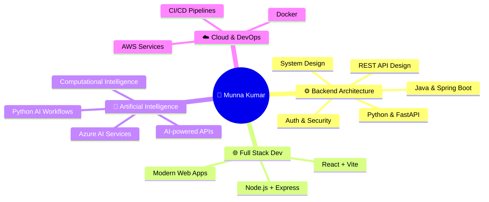

<div align="center">

<!-- ═══════════════════════════════════════════════════════════════ -->
<!-- ANIMATED HEADER -->
<!-- ═══════════════════════════════════════════════════════════════ -->


<!-- ANIMATED TYPING -->
<a href="https://git.io/typing-svg">
  
</a>

<br/>

<!-- ANIMATED WAVE HAND -->

<em>Hey there! Welcome to my GitHub profile</em>


<br/><br/>

<!-- SOCIAL BADGES WITH ANIMATION -->
<a href="https://github.com/MunnaKumar32990">
  
</a>&nbsp;
<a href="https://www.linkedin.com/in/munna-kumar-a08756339/">
  
</a>&nbsp;
<a href="mailto:munnakushw7@gmail.com">
  
</a>&nbsp;
<a href="https://www.codechef.com/users/klu2300032990">
  
</a>&nbsp;
<a href="https://leetcode.com/u/klu2300032990/">
  
</a>&nbsp;
<a href="https://medium.com/@munnakushw7">
  
</a>

<br/><br/>


&nbsp;
<a href="https://github.com/MunnaKumar32990?tab=followers">
  
</a>
&nbsp;
<a href="https://github.com/MunnaKumar32990?tab=repositories">
  
</a>

</div>

<!-- ═══════════════════════════════════════════════════════════════ -->
<!-- ANIMATED DIVIDER -->
<!-- ═══════════════════════════════════════════════════════════════ -->


##  &nbsp;About Me


```yaml
name: Munna Kumar
role: Backend & Full Stack Developer
location: India 🇮🇳
education: B.Tech in Computer Science

focus:
  - 🏗️ Scalable, secure, production-ready apps
  - 🔌 REST APIs & database-driven systems
  - 🧠 Applied AI & Computational Intelligence

currently_building:
  - Full-stack & backend applications
  - AI-oriented APIs with FastAPI

open_to:
  - 💼 Internships & Full-time roles
  - 🤝 Open-source collaboration
  - 💻 Freelance projects
```

<br/>

- ⚙️ Passionate about **backend architecture, REST APIs, auth, databases & system design**
- ☕ Building robust services with **Java & Spring Boot**
- 🐍 Developing AI-oriented APIs using **Python & FastAPI**
- ⚛️ Creating modern frontends with **React + Vite**
- 🤖 Exploring **Artificial Intelligence & Computational Intelligence**
- 🗄️ Working with **MySQL & MongoDB**
- ☁️ Deploying on **AWS & cloud platforms**
- 📝 Writing technical content on **[Medium](https://medium.com/@munnakushw7)**

<br clear="both"/>

<!-- ═══════════════════════════════════════════════════════════════ -->
<!-- ANIMATED DIVIDER -->
<!-- ═══════════════════════════════════════════════════════════════ -->


##  &nbsp;Tech Stack & Tools

<div align="center">

<!-- SKILL ICONS - Modern compact display -->
### 💻 Languages
<a href="https://skillicons.dev">
  
</a>

### ⚙️ Backend
<a href="https://skillicons.dev">
  
</a>

### 🌐 Frontend
<a href="https://skillicons.dev">
  
</a>

### 🗄️ Databases & Cloud
<a href="https://skillicons.dev">
  
</a>

### 🛠️ Tools & Platforms
<a href="https://skillicons.dev">
  
</a>

</div>

<br/>

<!-- DETAILED BADGE GRID -->
<details>
<summary><b>📋 Detailed Tech Stack (Click to expand)</b></summary>
<br/>

<table align="center">
<tr>
<td align="center"><b>Category</b></td>
<td align="center"><b>Technologies</b></td>
</tr>
<tr>
<td align="center"><b>💻 Languages</b></td>
<td>
  
  
  
  
</td>
</tr>
<tr>
<td align="center"><b>⚙️ Backend</b></td>
<td>
  
  
  
  
  
</td>
</tr>
<tr>
<td align="center"><b>🌐 Frontend</b></td>
<td>
  
  
  
  
  
  
</td>
</tr>
<tr>
<td align="center"><b>🗄️ Databases</b></td>
<td>
  
  
</td>
</tr>
<tr>
<td align="center"><b>🤖 AI / ML</b></td>
<td>
  
  
  
</td>
</tr>
<tr>
<td align="center"><b>☁️ Cloud & DevOps</b></td>
<td>
  
  
  
  
  
</td>
</tr>
</table>

</details>

<!-- ═══════════════════════════════════════════════════════════════ -->
<!-- ANIMATED DIVIDER -->
<!-- ═══════════════════════════════════════════════════════════════ -->


##  &nbsp;What I Build

<div align="center">

<table>
<tr>
<td align="center" width="170">
<br/>
<b>Backend Services</b><br/>
<sub>Java • Spring Boot • FastAPI</sub>
</td>
<td align="center" width="170">
<br/>
<b>REST APIs</b><br/>
<sub>Auth • CRUD • Microservices</sub>
</td>
<td align="center" width="170">
<br/>
<b>Database Systems</b><br/>
<sub>MySQL • MongoDB</sub>
</td>
</tr>
<tr>
<td align="center" width="170">
<br/>
<b>Full Stack Apps</b><br/>
<sub>React • Vite • Node.js</sub>
</td>
<td align="center" width="170">
<br/>
<b>AI Applications</b><br/>
<sub>Python • AI APIs • FastAPI</sub>
</td>
<td align="center" width="170">
<br/>
<b>Cloud Deployment</b><br/>
<sub>AWS • Docker</sub>
</td>
</tr>
</table>

</div>

<!-- ═══════════════════════════════════════════════════════════════ -->
<!-- ANIMATED DIVIDER -->
<!-- ═══════════════════════════════════════════════════════════════ -->


##  &nbsp;Featured Projects

<!-- PROJECT 1 -->
<details open>
<summary><b>🎙️ Gram Vaani — AI Voice Assistant for Rural India</b></summary>
<br/>

<div align="center">

> 🏆 An AI-powered voice assistant designed to help users interact with digital services through voice-based communication, focused on accessibility and rural use cases.

<br/>


<br/><br/>

**Key Features:**
- 🎤 Voice-based interaction for rural accessibility
- 🌐 Multi-language support
- 🤖 AI-powered responses using Azure OpenAI
- 📊 Analytics dashboard

<br/>

[](https://github.com/MunnaKumar32990/AI-RURAL-VOICE-ASSISTANT)

</div>

</details>

<!-- PROJECT 2 -->
<details open>
<summary><b>📦 Voice-Based Inventory Management</b></summary>
<br/>

<div align="center">

> 📦 A full-stack inventory management platform exploring voice-driven interactions for small businesses.

<br/>


<br/><br/>

**Key Features:**
- 🎤 Voice-driven inventory operations
- 📋 Real-time stock tracking
- 📊 Business analytics & reporting
- 🔐 Secure authentication

<br/>

[](https://github.com/MunnaKumar32990/Voice-Based-Inventory-Management-for-Small-Businesses)

</div>

</details>

<!-- PROJECT 3 -->
<details open>
<summary><b>🛒 Full Stack E-Commerce Application</b></summary>
<br/>

<div align="center">

> 🛍️ A complete e-commerce application with user-facing shopping functionality and backend services for managing products and business operations.

<br/>


<br/><br/>

**Key Features:**
- 🛒 Product browsing & shopping cart
- 💳 Order management system
- 👤 User authentication & profiles
- 📊 Admin dashboard

</div>

</details>

<br/>

<div align="center">

[](https://github.com/MunnaKumar32990?tab=repositories)

</div>

<!-- ═══════════════════════════════════════════════════════════════ -->
<!-- ANIMATED DIVIDER -->
<!-- ═══════════════════════════════════════════════════════════════ -->


##  &nbsp;GitHub Analytics

<div align="center">

<!-- STATS ROW 1 -->
<a href="https://github.com/MunnaKumar32990">
  
</a>
&nbsp;&nbsp;
<a href="https://github.com/MunnaKumar32990">
  
</a>

<br/><br/>

<!-- STREAK STATS -->
<a href="https://github.com/MunnaKumar32990">
  
</a>

<br/><br/>

<!-- TROPHIES -->
<a href="https://github.com/MunnaKumar32990">
  
</a>

<br/><br/>

<!-- ACTIVITY GRAPH -->
<a href="https://github.com/MunnaKumar32990">
  
</a>

</div>

<!-- ═══════════════════════════════════════════════════════════════ -->
<!-- CONTRIBUTION SNAKE -->
<!-- ═══════════════════════════════════════════════════════════════ -->

<div align="center">

### 🐍 Contribution Snake

<picture>
  <source media="(prefers-color-scheme: dark)" srcset="https://raw.githubusercontent.com/MunnaKumar32990/MunnaKumar32990/output/github-snake-dark.svg" />
  <source media="(prefers-color-scheme: light)" srcset="https://raw.githubusercontent.com/MunnaKumar32990/MunnaKumar32990/output/github-snake.svg" />
  
</picture>

> 💡 *To enable the snake animation, add the GitHub Actions workflow below to your profile repo!*

</div>

<!-- ═══════════════════════════════════════════════════════════════ -->
<!-- ANIMATED DIVIDER -->
<!-- ═══════════════════════════════════════════════════════════════ -->


## 🧠 Currently Exploring

<div align="center">



</div>

<!-- ═══════════════════════════════════════════════════════════════ -->
<!-- ANIMATED DIVIDER -->
<!-- ═══════════════════════════════════════════════════════════════ -->


## ✍️ Technical Writing & Blog

<div align="center">

I enjoy documenting what I learn and sharing technical knowledge through development and AI-related content.

<br/>

<a href="https://medium.com/@munnakushw7">
  
</a>

<br/><br/>

<a href="https://medium.com/@munnakushw7">
  
</a>

</div>

<!-- ═══════════════════════════════════════════════════════════════ -->
<!-- ANIMATED DIVIDER -->
<!-- ═══════════════════════════════════════════════════════════════ -->


## 📈 Coding Profiles

<div align="center">

<a href="https://leetcode.com/u/klu2300032990/">
  
</a>

</div>

<!-- ═══════════════════════════════════════════════════════════════ -->
<!-- ANIMATED DIVIDER -->
<!-- ═══════════════════════════════════════════════════════════════ -->


<div align="center">

## ⚡ Beyond Code


<br/><br/>

> *"Build. Learn. Improve. Repeat."*

<br/>

I enjoy exploring new technologies, building practical applications, solving engineering problems, and continuously improving my development skills.

<br/>

### 🚀 Building scalable software with a backend-first mindset.

<br/>

⭐ If you find my projects interesting, feel free to explore my repositories and connect with me!

<br/><br/>

<!-- CONNECT WITH ME -->
<a href="https://github.com/MunnaKumar32990">
  
</a>
&nbsp;
<a href="https://github.com/MunnaKumar32990?tab=followers">
  
</a>
&nbsp;
<a href="https://www.linkedin.com/in/munna-kumar-a08756339/">
  
</a>

<br/><br/>

<!-- ANIMATED FOOTER -->


</div>
